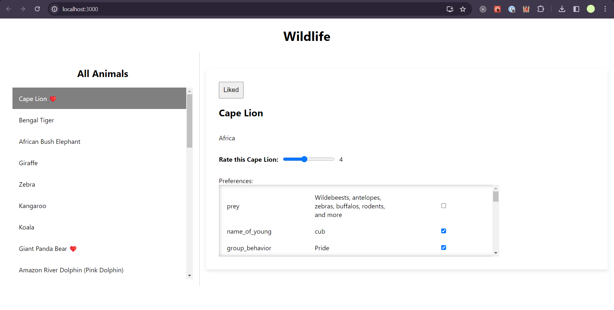

# Rate Wildlife

## Overview

Explore wild life with it's attributes and create your own list.

## Folder Structure

- **components**: Contains React components used in your application.
- **constants**: Stores constants or configurations used across the project.
- **services**: Includes services or utilities that interact with external APIs or perform specific tasks.
- **utils**: Houses general utility functions that can be reused throughout the project.

## Available Scripts

In the project directory, you can run:

### `npm install`

Installs all the required dependencies.

### `npm start`

Runs the app in the development mode.\
Open [http://localhost:3000](http://localhost:3000) to view it in your browser.

The page will reload when you make changes.\
You may also see any lint errors in the console.

## Usage

- This uses [animals API](https://api-ninjas.com/api/animals) to fetch the list of animals at first
- Utilises local storage of the client's browser.
- Allows user to rate an animal, select certain preferences that they might like.

### Example

